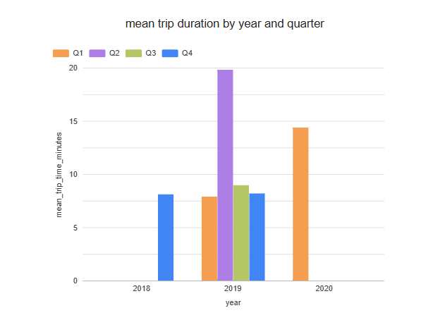

## 3. Look at you data
### a. What kind of data is?
The downloaded data consists of trip records from a bike-sharing company, Divvy.
Each row in the dataset represents an individual trip, including information about trip duration, start and end times, stations, and some user data.
The downloaded data belongs to the field of public transportation, specifically a bike-sharing service.

### b. Can you think of analyses that can be made with this?
From this data, different analyses related to the use of the bicycle service can be performed. For example, it is possible to calculate the average trip duration and how it changes over time, as well as analyze the evolution of the service usage across different years.

In addition, by looking at the data, conclusions can be made about user behavior, such as usage habits depending on the time of year or the frequency of service usage. This type of analysis can be useful to better understand when more bicycles are needed, where they should be placed, and how to redistribute them.

### c. Is the data normalized or denormalized?
The data is denormalized. Each record contains all the information related to a trip, including trip details, station information and user data, stored in a single table instead of being separated into multiple related tables.

### d. It's needed any processing before we use it?
Yes, preprocessing is necessary before using the data. Some quarters have different columns, even though the information is the same.
For this reason, it is necessary to clean the data, convert the value types, and standardize the date and duration formats before it can be analyzed correctly.

### e. Are there null values? In which fields? Measure how many and guess a reason.
Yes, the dataset contains null values ​​in some fields. These values ​​appear mainly in columns related to trip duration, stations, and some user data.
The presence of null values ​​may be due to incomplete records, errors during data collection, or changes in the dataset structure between different quarters. Therefore, it is necessary to identify and address these values ​​before performing reliable analyses.

## 5. Analysis you consider
As a further analysis, the average trip duration was compared across different quarters to identify seasonal patterns in bike service usage. Using trip duration data, it was observed that the second quarter (Q2) shows a longer average trip duration compared to other quarters. This difference could be explained by factors such as better weather conditions and greater tourist activity during the spring and summer months.
This analysis helps to better understand how user behavior changes throughout the year and provides useful information for improving service organization.

## 7. Think of the need of delivery the data. How you will do it?
To deliver the data, the processed file generated by the script can be shared in a common location, such as cloud storage or a shared folder. This allows other users to easily access the cleaned and processed data without needing to repeat the entire process. The original raw data can also be kept for reference, while the processed data is used for analysis or visualization. The data can be used by analysts to create reports, by data scientists to build models or perform deeper analysis, and by business teams to support decision-making and improve the planning of the bicycle service. This approach makes the data easy to share, reuse, and maintain.