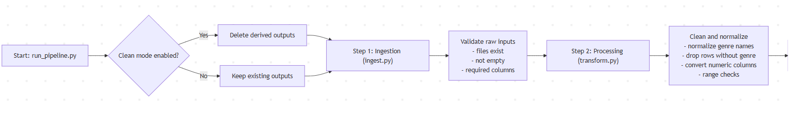
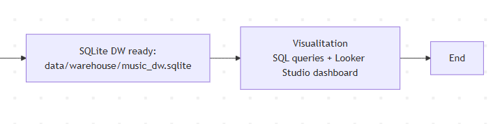
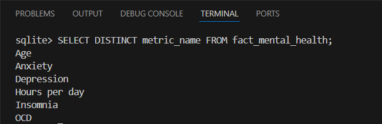
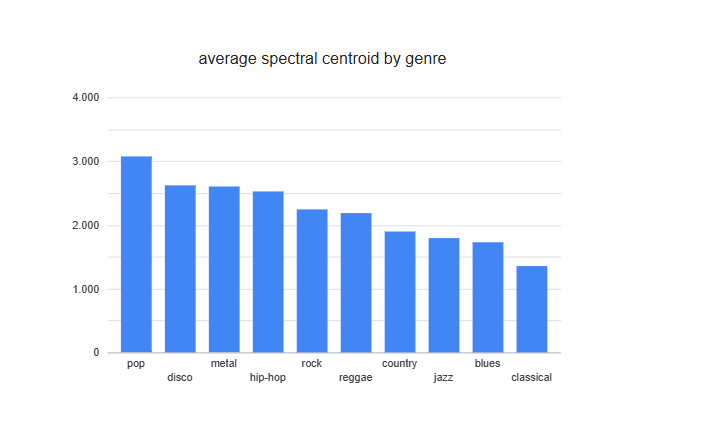

# Data Engineering Project: Music and Mental Health

## 1. Introduction
In this project I have built an end-to-end data pipeline using Python, starting from two datasets related to music and mental health.

I chose these datasets because I like music and because this topic relates to mental health, allowing me to analyze how different musical genres affect people's mental health. These two datasets are linked by musical genre and allow me to perform the entire data lifecycle, visualize the information, and draw appropriate conclusions.

The goal is to perform a complete data lifecycle and ETL (Extract, Transform, Load) process. To achieve this, using the downloaded CSV files, we have performed the following:
- Ingestion: validation of input CSV files, checking their existence, size and structure (expected columns) before starting any processing
- Storage (raw): the raw data is stored
- Processing: clean, normalize, and group data
- Storage (processed): the data is stored after it has been processed
- Serving: the results are stored in a Data Warehouse (SQLite) so that SQL queries can be performed
- Visualization: a dashboard is created in Locker Studio with data insights

Furthermore, this project includes:
- Orchestration: the pipeline is executed all at once with run_pipeline.py
- Logging: what happens at each step is recorded
- Alerting: it notifies you if any step in the pipeline fails

## 2. Data lifecycle
This project implements a complete data lifecycle, following the route of data from acquisition to visualization. Each phase of this pipeline is described below.

### 2.1 Generation and Retrieval 
The data used comes from two external sources:
- one of a dataset of musical characteristics
- the other is a dataset on music and mental health

In this case, the CSV files have been previously downloaded, so a download process is not included within the pipeline.

 ### 2.2 Ingestion
The ingestion phase in this project is done in batch mode, which means that the data is processed as complete files and not in real time.

This type of ingestion is suitable because the datasets are received as CSV files and do not change constantly. The pipeline runs when data processing is required, reading all the files at once.

In the script ingest.py, batch ingestion is responsible for:
- verify that the CSV files exist
- verify that they are not empty
- validate that they contain the necessary columns

If any of these checks fail, the pipeline stops to avoid processing incorrect data.

### 2.3 Storage (raw)
Once validated, the data is stored in its original format within the data/raw folder.
This storage corresponds to the raw data, without any transformation applied, allowing a copy of the original data to be preserved.

### 2.4 Processing
In this phase, raw data is transformed into clean data so that analysis can be performed and value extracted from it.

First, the data is normalized by mapping the label variable (musical genre) so that entries of the same genre are written identically. Additionally, numerical values ​​outside the acceptable ranges are cleaned to prevent incorrect data from affecting the results.

Next, for each dataset, the existence of the column related to musical genre is checked. The ones that don't have genre information are removed, as this variable is key to the analysis. Later, a new column called genre is created with the normalized values.

Once the necessary columns have been created, only the variables relevant to the analysis are selected, discarding those that do not contribute value. Finally, when both datasets are cleaned and normalized, the data are grouped by musical genre, calculating average values ​​and ordering the results to facilitate interpretation.

### 2.5 Storage (processed)
After processing, the resulting data is stored in the data/processed folder.
At this point, the data is already cleaned and aggregated, and is saved as intermediate tables ready to be loaded into the data warehouse.

### 2.6 Serving
In the serving phase, the processed data is loaded into a Data Warehouse implemented with SQLite, using the script load_dw.py.  
A simple galaxy-shaped model is used, with:
- a dimension table for musical genres
- fact tables for music and mental health metrics

        -->CREATE TABLE IF NOT EXISTS dim_genre (
                genre_id INTEGER PRIMARY KEY AUTOINCREMENT,
                genre TEXT NOT NULL UNIQUE
            );

        -->CREATE TABLE IF NOT EXISTS fact_music_features (
                genre_id INTEGER NOT NULL,
                feature_name TEXT NOT NULL,
                feature_value REAL,
                PRIMARY KEY (genre_id, feature_name),
                FOREIGN KEY (genre_id) REFERENCES dim_genre(genre_id)
            );

        -->CREATE TABLE IF NOT EXISTS fact_mental_health (
                genre_id INTEGER NOT NULL,
                metric_name TEXT NOT NULL,
                metric_value REAL,
                PRIMARY KEY (genre_id, metric_name),
                FOREIGN KEY (genre_id) REFERENCES dim_genre(genre_id)
            );

This storage allows for efficient SQL queries to be performed on the final data.

### 2.7 Visualization
Finally, the data stored in the Data Warehouse is used for analysis.
A dashboard is created in Looker Studio that visualizes various insights, such as:
- average spectral centroid by genre
- average anxiety by genre
- average music listening hours per day by genre

This last phase represents the final consumption of the data by the user.

## Images of the Pipeline Flow Diagram

## 3. ETL Process
The project implements an ETL (Extract, Transform, Load) process that converts raw data into structured information ready for analysis. Each phase of the ETL process corresponds to a specific part of the pipeline.

### 3.1 Extract
In the Extract phase, the data is read from CSV files previously downloaded and stored in the data/raw folder.

During this phase the data is not modified, but it is done:
- reading CSV files
- the validation of its structure and content 
  
This phase is closely related to the ingestion stage of the data lifecycle, ensuring that the input data is correct before being transformed.

### 3.2 Transform
The Transform phase is responsible for cleaning and preparing the data for analysis. This stage includes operations such as:
- standardization of musical genres
- cleaning of null values ​​and out-of-range values
- converting columns to numeric types
- selection of relevant variables
- group the data by musical genre

The result of this phase is smaller, more consistent datasets that are suitable for storage and analysis.

### 3.3 Load
In the Load phase, the transformed data is loaded into a data warehouse implemented with SQLite.

The data is inserted following a galaxy schema, with a dimension table for music genres and fact tables for music and mental health metrics. This structure facilitates SQL queries and subsequent data consumption by visualization tools.

## 4. Data Warehouse and SQL Queries
Once the ETL phase is complete, the processed data is loaded into a data warehouse implemented with SQLite. This data warehouse allows the data to be stored in a structured format and enables SQL queries to be performed for analysis.

### 4.1 Data Warehouse Model
The model used is a galaxy schema, composed of:

- dim_genre: dimension table containing a unique record for each musical genre
- fact_music_features: fact table that stores musical characteristics grouped by genre
- fact_mental_health: fact table that stores mental health indicators grouped by genre

### 4.2 Example SQL Queries
Below are some examples of SQL queries performed on the Data Warehouse

- Query 1: List of genres

- Query 2: All mental health metrics

- Query 3: Average anxiety by genre

- Query 4: Average listening hours by genre

## 5. Dashboard and Data Insights
A dashboard was created in Looker Studio to visualize the data, using the processed datasets generated by the pipeline.

The dashboard aims to visualize data on musical genres, music characteristics, and mental health indicators, providing insights in a visual and intuitive way.

To do this, we have created three bar graphs.

-Dashboard 1: average spectral centroid by genre

-Dashboard 2: average anxiety by genre

-Dashboard 3: average music listening hours per day by genre

These graphs show that the results vary depending on the musical genre. Each genre has distinct musical characteristics, and depending on the genre, people's mental health is affected differently.

## 6. Scalability of the proyect
This project works correctly at a small scale in a local environment, as it uses CSV files, pandas processing, and a SQLite data warehouse. However, if the data volume were to grow significantly (x10, x100, x1000, or even x10^6), limitations would appear in various parts of the pipeline.

### 6.1 What happens when you scale the volume of data
- x10 data
  - the pipeline could still be done locally
  - this would increase CSV reading time and execution time
  - the performance would still be valid if the computer has enough memory

- x100 data
  - processing with pandas would start to become slower and memory consumption would increase
  - problems could arise if the dataset does not fit completely in RAM
  - the pipeline execution time could range from seconds/minutes to several minutes or more

- x1000 data
  - locally, pandas and CSV storage are no longer suitable
  - techniques such as chunks would need to be used to execute it
  - SQLite would still work for testing, but it would no longer be a good option as a primary Data Warehouse

- x10^6 data
  - it couldn't be done locally
  - this would require a cloud architecture and tools designed for large volumes:
    - cloud storage (S3)
    - Data Warehouse cloud (BigQuery, Snowflake)

### 6.2 Main problems of the project if scalability increases
As the volume of data increases, the most likely problems are:

- CSV reading and writing: CSV files are not optimized for large volumes
- In-memory processing: requires loading data into RAM, which limits the size
- loading and querying in SQLite: SQLite is useful as a local solution, but it is not intended as a scalable Data Warehouse with multiple users or large tables

### 6.3 Upgrades for scaling
If the project needed to scale, the same stages could be maintained (ingest -> transform -> load), but with different technologies:

- replace CSV with more efficient formats 
- more efficient batch processing (chunks)
- replace SQLite with a cloud-based Data Warehouse (BigQuery)
- Cloud Orchestration (Cloud Composer)

## 7. Cloud cost estimation (Google Cloud Platform)
To estimate the cost of migrating this project to the cloud, Google Cloud Platform (GCP) was chosen. The estimate was made using the official Google Cloud pricing calculator and considering different data growth scenarios (x10, x100, x1000, and x10^6) relative to the original dataset size. It was estimated in Madrid localization.

The services that have been considered are:
- Cloud Storage: for the storage of raw and processed data
- BigQuery (price on demand): as a Data Warehouse for running queries 
- Looker Studio: is free

The original datasets are very small (on the order of megabytes), so costs in small and medium-sized scenarios remain very low. The following description summarizes the approximate monthly costs for each scenario:

- x10:  
  With approximately 0.01 GB stored in Cloud Storage, 1 GB stored in BigQuery, and around 1 GB of data processed per query per month, the estimated monthly cost is close to 0 euros

- x100:  
  With approximately 0.1 GB in Cloud Storage, 5 GB of storage in BigQuery, and between 5 and 10 GB of data queried monthly, the estimated cost remains below 1 euro per month

- x1000:  
  With around 1 GB in Cloud Storage, between 20 and 50 GB stored in BigQuery and between 50 and 100 GB of data processed by queries, the monthly cost increases to a few euros (1-2.5 euros approximately)

- x10^6:  
  In a large scenario, with approximately 1 TB stored in Cloud Storage, between 100 and 500 GB of storage in BigQuery and around 1 TB of data processed monthly, the estimated cost reaches tens of euros per month (approximately 50 euros).

In conclusion, the project can be migrated to the cloud at almost no cost when there is little data, while in high-volume scenarios the most expensive part is the processing of queries in BigQuery, more than the storage of data.

## 8. Data Consumers
The data generated by this project can be used by different user profiles, each with different needs. The pipeline and data warehouse design allows data delivery to be used by each type of user.

- Data analysts:  
  They can access the data stored in the Data Warehouse (SQLite or BigQuery in the cloud) using SQL queries to perform exploratory analysis and generate additional metrics

- Stakeholders:  
  View the data through dashboards in Looker Studio, where information is presented visually and intuitively, facilitating decision-making without the need for technical knowledge

- Data scientists:  
  You can use the processed data as a starting point for more advanced analysis or predictive models, exporting the results from the Data Warehouse or directly accessing the final CSV files

- Data engineers:  
  They can reuse the pipeline to incorporate new data, modify transformations, or scale the project to the cloud

In this way, the data is delivered appropriately according to the type of user.

## 9. How AI can help with any of the processes
AI can add value at various points along the pipeline.

In the ingestion phase, AI techniques could be used to automatically detect errors in the input data, such as incorrectly uploaded files or files with an incorrect structure.

In the processing phase, AI can assist in cleaning and normalizing the data. For example, techniques like clustering could be used to group musical genres and identify those that are mislabeled.

In the analysis phase, the processed data could be used for machine learning models to detect patterns, group users, or predict mental health indicators related to musical genres.

Finally, in the visualization, generative AI could be used to create automatic explanations of the results obtained in the dashboards, facilitating the interpretation of the results for people without technical knowledge.

In conclusion, AI doesn't replace the data pipeline, complements it, allowing the automation of tasks, improved data quality, and better use from the information obtained.

## 10. Is there any concern about privacy?
In this project, no sensitive personal data is handled; the datasets used contain data related to musical genres and mental health.

Even so, we can consider the privacy of some data. Since, after all, we are talking about mental health, it is necessary to handle it responsibly, preventing it from being linked to any particular individual.

Therefore, it might be advisable to use additional privacy measures by anonymizing the data or restricting access to the data warehouse.

So, even though we use public data, it is good to consider the privacy of certain data.

## Conclusion
This project has developed a complete Data Engineering pipeline, covering the entire data lifecycle from ingestion to serving (data warehouse) and final data visualization. Through cleaning, transformation, and storage processes, the information has been structured in a way that allows for efficient analysis and visualization. Furthermore, scalability, cost, privacy, and the use of artificial intelligence have been considered to provide a potential solution for various growth scenarios.

